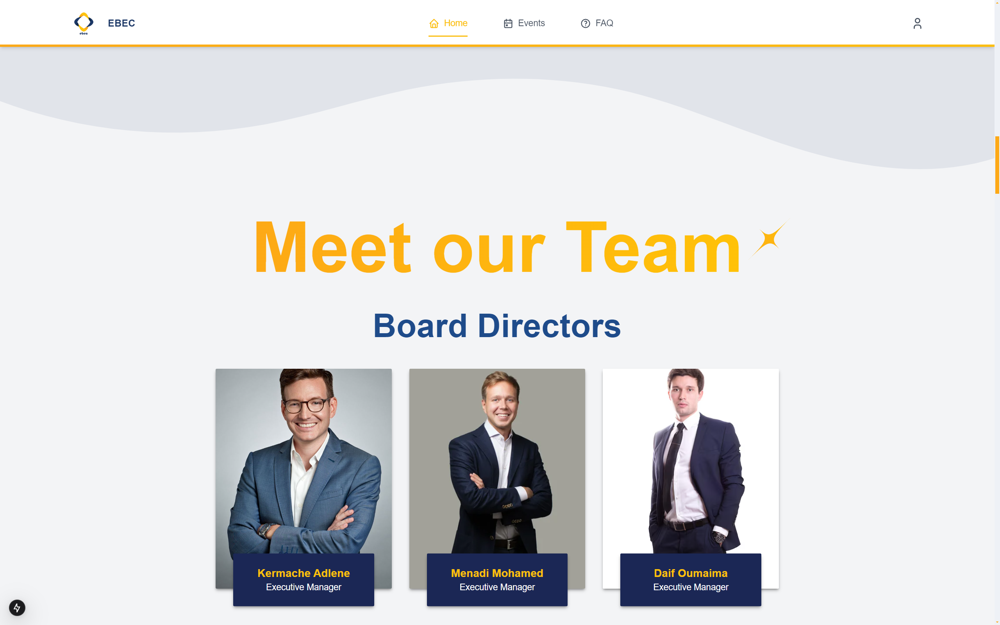

# Welcome To EBEC's Official Website Repository
Private repo, available for IT responsibles only

This repository contains the codebase for the official website of EBEC (ENSIA Business & Entrepreneurship Club). The website serves as a central hub for information about the club, its events, team members, and resources. It is built using modern web technologies such as ReactJs, NextJs, SupaBase, and Tailwind CSS to provide a responsive and engaging experience for visitors.

## Screenshots [Preview]
- Better be experienced by yourself, but until it's all done, here's a small preview of this website's content:


<!-- include the screenshots in the screenshots/folder -->


**Hero Section**: Beautiful landing animations, that continues on scroll



**Team Introduction**: Meet our dedicated team members.(waiting for official pics)


**Our Secret Formula!**: A mix of all the skills you need!


**Remember the moments!**: Cherish the memorable moments from our events.


**Our Services**: Overview of the services we offer.


**Events Page**: Beautiful splash image to entertain your eyes.


**Stay Updated**: Keep up with our latest events and updates.


**Our Activities**: Explore the various activities we organize.


**Discover our previous events!**: Browse through our event gallery.


**A portion of the Admin board**: Manage and organize all parts of the club!


**Login/Sign Up**: Access your account or create a new one.


**User settings**: Customize your profile and preferences.

## Getting Started

First, run the development server:

```bash
npm run dev
```

Open [http://localhost:3000](http://localhost:3000) with your browser to see the result.


## Collaboration

- I did it all by myself, I don't need assistance.
<!-- wanna kill myself -->


## The Tech-Stack:

- ReactJs
- NextJs
- SupaBase
- Tailwind CSS
- HTML,CSS,JS

## The Structure :

- All code is inside the `src` folder
- The Folders inside `src/app` represent `URLs` ( using NextJS App-Router )  
- Sections are stored inside `widgets` & Components are inside `components`
- Usage of Aceternity UI included `lib` and `hooks` folders

---

> ## **Warning :**
>
> Communicate with team in order to receive the `.env` file needed for development

